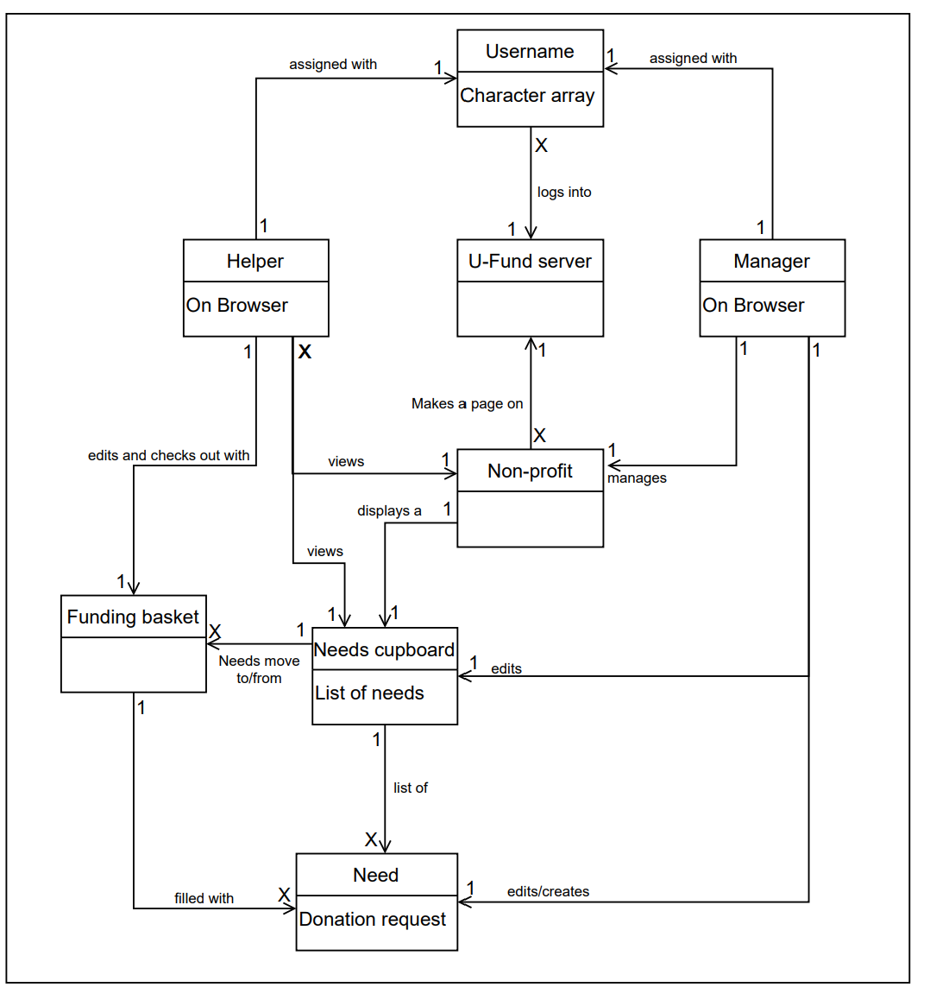
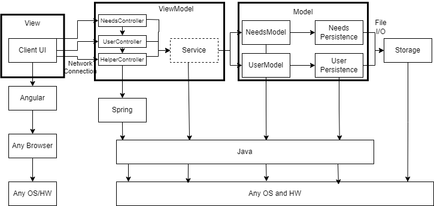
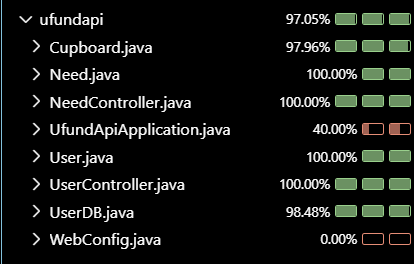

# PROJECT Design Documentation

> _The following template provides the headings for your Design
> Documentation.  As you edit each section make sure you remove these
> commentary 'blockquotes'; the lines that start with a > character
> and appear in the generated PDF in italics but do so only **after** all team members agree that the requirements for that section and current Sprint have been met. **Do not** delete future Sprint expectations._

## Team Information
* Team name: Team 2
* Team members
  * Rushil Patel
  * Jacob Eggleston
  * Quinton Miller
  * Micheal Bhardwaj

## Executive Summary

This project addresses the challenges faced by organizations in connecting with helpers to fulfill their needs. The MVP includes basic authentication, helper functionalities to view,
search, and manage needs, and needs management for U-fund Managers. This software application aims to provide non-profits with an efficient and reliable platform to manage and meet 
their needs.

### Purpose
>  _**[Sprint 2 & 4]** Provide a very brief statement about the project and the most
> important user group and user goals._
The purpose of this project is to create a application that introduces a Need management service for companies, such that an admin can given helpers a list of needs to be completed and the helpers can take the needs, complete them, and checkout to signify fcompleting thier needs.

### Glossary and Acronyms
> _**[Sprint 2 & 4]** Provide a table of terms and acronyms._

| Term | Definition |
|------|------------|
| SPA | Single Page |
| DB | Database |

## Requirements

This section describes the features of the application.

> _In this section you do not need to be exhaustive and list every
> story.  Focus on top-level features from the Vision document and
> maybe Epics and critical Stories._

A helper is able to see and search for needs, while being able to add needs to their own funding basket and checking it out. 

A Manager can add, edit, or remove data from their cupboard.

A User is able to securely log in and out, while keeping their data stored in their profile. 

### Definition of MVP
> _**[Sprint 2 & 4]** Provide a simple description of the Minimum Viable Product._

The MVP includes basic authentication, helper functionalities to view, search, and manage needs, and needs management for U-fund Managers.

### MVP Features
>  _**[Sprint 4]** Provide a list of top-level Epics and/or Stories of the MVP._

As a Helper, I want to manage a list of needs, so that I can efficiently sort through my list of needs. 

As a User, I want to see different interfaces for the roles of Helper and U-Fund Manager, so that I can’t use other roles’ actions.

As a U-Fund Manager, I want to manage the needs in the needs cupboard, so that the important needs are available for Helpers. 

### Enhancements
> _**[Sprint 4]** Describe what enhancements you have implemented for the project._

## Application Domain

This section describes the application domain.

> _**[Sprint 2 & 4]** Provide a high-level overview of the domain for this application. You
> can discuss the more important domain entities and their relationship
> to each other._

There are three main components of the domain model: Helper, Manager, and Need. Between these relationships are more entities that are used by either of three main entities in varying relationships. A Need can be placed into a Needs Cupboard, while a Manager can edit the Need and a Helper can view the Need. A Need can be placed into a funding backet by a Helper, who can checkout with that Need. All these relationships belong in a Non-Profit company, who has a page on a U-Fund server that needs a username for a Helper or Manager to login. 

## Architecture and Design

This section describes the application architecture.

### Summary

The following Tiers/Layers model shows a high-level view of the webapp's architecture. 
**NOTE**: detailed diagrams are required in later sections of this document.
> _**[Sprint 1]** (Augment this diagram with your **own** rendition and representations of sample system classes, placing them into the appropriate M/V/VM (orange rectangle) tier section. Focus on what is currently required to support **Sprint 1 - Demo requirements**. Make sure to describe your design choices in the corresponding _**Tier Section**_ and also in the _**OO Design Principles**_ section below.)_

The web application, is built using the Model–View–ViewModel (MVVM) architecture pattern. 

The Model stores the application data objects including any functionality to provide persistance. 

The View is the client-side SPA built with Angular utilizing HTML, CSS and TypeScript. The ViewModel provides RESTful APIs to the client (View) as well as any logic required to manipulate the data objects from the Model.

Both the ViewModel and Model are built using Java and Spring Framework. Details of the components within these tiers are supplied below.

### Overview of User Interface

This section describes the web interface flow; this is how the user views and interacts with the web application.

> _Provide a summary of the application's user interface.  Describe, from the user's perspective, the flow of the pages in the web application._

### View Tier
> _**[Sprint 4]** Provide a summary of the View Tier UI of your architecture.
> Describe the types of components in the tier and describe their
> responsibilities.  This should be a narrative description, i.e. it has
> a flow or "story line" that the reader can follow._

> _**[Sprint 4]** You must  provide at least **2 sequence diagrams** as is relevant to a particular aspects 
> of the design that you are describing.  (**For example**, in a shopping experience application you might create a 
> sequence diagram of a customer searching for an item and adding to their cart.)
> As these can span multiple tiers, be sure to include an relevant HTTP requests from the client-side to the server-side 
> to help illustrate the end-to-end flow._

> _**[Sprint 4]** To adequately show your system, you will need to present the **class diagrams** where relevant in your design. Some additional tips:_
 >* _Class diagrams only apply to the **ViewModel** and **Model** Tier_
>* _A single class diagram of the entire system will not be effective. You may start with one, but will be need to break it down into smaller sections to account for requirements of each of the Tier static models below._
 >* _Correct labeling of relationships with proper notation for the relationship type, multiplicities, and navigation information will be important._
 >* _Include other details such as attributes and method signatures that you think are needed to support the level of detail in your discussion._

### ViewModel Tier
> _**[Sprint 1]** List the classes supporting this tier and provide a description of there purpose._

NeedsController: Connects the Need model to the application using REST API

UserController: Connects the User model to the application using REST API

> _**[Sprint 4]** Provide a summary of this tier of your architecture. This
> section will follow the same instructions that are given for the View
> Tier above._

> _At appropriate places as part of this narrative provide **one** or more updated and **properly labeled**
> static models (UML class diagrams) with some details such as critical attributes and methods._
> 

### Model Tier
> _**[Sprint 1]** List the classes supporting this tier and provide a description of there purpose._

Need: The model for a singular need that users can create. 

Cupboard: Acts as the Needs Data Persistence such that there can be a list of needs managed and sychronized with the Controller. It hold the MVP functional resposibilities of actions on a Need. 

User: The model for a singular user that is either a Helper or Manager.

UserDB: Is the User Data Persistence holding a list of users in the U-Fund server. It contains the functions that the UserController will need to communicate with the application.

> _**[Sprint 2, 3 & 4]** Provide a summary of this tier of your architecture. This
> section will follow the same instructions that are given for the View
> Tier above._

The model tier, consisting of the Need class and User class, creates the foundation for the Need and User features that have the functionality to be used for other tiers.

> _At appropriate places as part of this narrative provide **one** or more updated and **properly labeled**
> static models (UML class diagrams) with some details such as critical attributes and methods._
> 

## OO Design Principles

> _**[Sprint 1]** Name and describe the initial OO Principles that your team has considered in support of your design (and implementation) for this first Sprint._

We used the Information Expert principle to make sure we each class has it's responsibility and no others, making the controllers easier to make. 

> 

> _**[Sprint 2, 3 & 4]** Will eventually address upto **4 key OO Principles** in your final design. Follow guidance in augmenting those completed in previous Sprints as indicated to you by instructor. Be sure to include any diagrams (or clearly refer to ones elsewhere in your Tier sections above) to support your claims._

> _**[Sprint 3 & 4]** OO Design Principles should span across **all tiers.**_

We also used the Controller principle to connect the model to the application seemlessly. The Controller acts as the middle class that takes information from the different models it needs and returns information to the UI, such that the UI is able to express correctly what happened in the backend, whether the action performed correctly or with errors.

## Static Code Analysis/Future Design Improvements
> _**[Sprint 4]** With the results from the Static Code Analysis exercise, 
> **Identify 3-4** areas within your code that have been flagged by the Static Code 
> Analysis Tool (SonarQube) and provide your analysis and recommendations.  
> Include any relevant screenshot(s) with each area._

> _**[Sprint 4]** Discuss **future** refactoring and other design improvements your team would explore if the team had additional time._

## Testing
> _This section will provide information about the testing performed
> and the results of the testing._

### Acceptance Testing
> _**[Sprint 2 & 4]** Report on the number of user stories that have passed all their
> acceptance criteria tests, the number that have some acceptance
> criteria tests failing, and the number of user stories that
> have not had any testing yet. Highlight the issues found during
> acceptance testing and if there are any concerns._

As of Sprint 2, all user stories have passed all their acceptance criteria tests and none are having errors.

Issues found during acceptance testing: The user search functionality is case-sensitive, which was not specified in the initial requirements.

Concern: The case sensitivity issue needs to be addressed before the final release.

### Unit Testing and Code Coverage
> _**[Sprint 4]** Discuss your unit testing strategy. Report on the code coverage
> achieved from unit testing of the code base. Discuss the team's
> coverage targets, why you selected those values, and how well your
> code coverage met your targets._

>_**[Sprint 2, 3 & 4]** **Include images of your code coverage report.** If there are any anomalies, discuss
> those._

Our unit testing strategy focused on comprehensive coverage of all the methods, including edge cases and concurrency scenarios. We aimed high (90%) to ensure robustness and reliability in this core functionality.

We achieved 100% code coverage for the Need, Need Controller User and UserController classes, exceeding our target. Even on the remaining files out coverage was >97%. This high coverage ensures that most scenarios, including error cases and edge conditions, are tested.

However, we noted that some complex concurrency scenarios were challenging to test comprehensively, which is an area for future improvement.

Anomaly: While overall coverage is high, we noticed that some exception handling code paths were not fully exercised. In future iterations, we plan to introduce more fault injection tests to cover these scenarios.

## Ongoing Rationale
>_**[Sprint 1, 2, 3 & 4]** Throughout the project, provide a time stamp **(yyyy/mm/dd): Sprint # and description** of any _**mayor**_ team decisions or design milestones/changes and corresponding justification._

**(2024/07/11): Sprint 3**
As a team, we decided we needed to add a Helper class and Helper Controller to implement the Helper functionality. We decided we were going to extend the User class to adhere to Object Oriented Design principles and to make it easier to implement the Helper class.

**(2024/07/15): Sprint 3**
We were able to come up with a design for the UI and implement the UI such that the UI flow is working without any of the specific user functionality. We are going to create a Needs page, homepage, and login page, where the functinality on each will be showing or hidden depending on the user login. The login page will determine whether the user is an admin (username is "admin") or a Helper (any other username). 